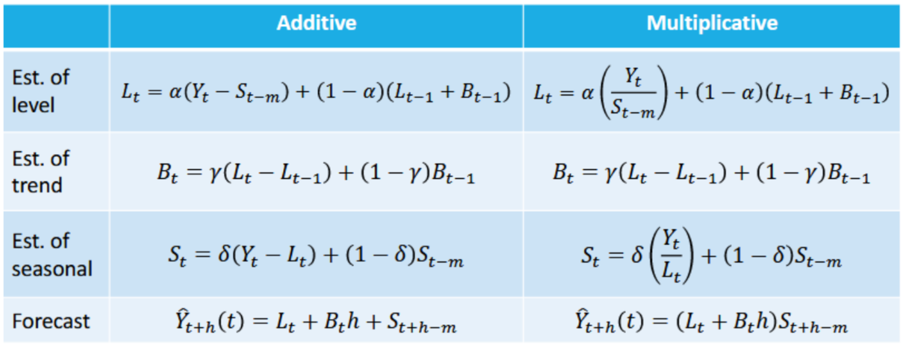
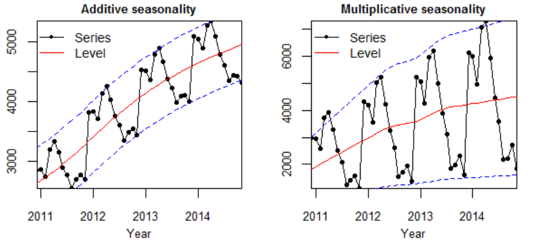

```{r}
print("test push ke github")
```

## Library/Packages

```{r}
#install.packages("forecast")
#install.packages("graphics")
#install.packages("TTR")
#install.packages("TSA")
library("forecast")
library("graphics")
library("TTR")
library("TSA")
library("ggplot2")
```

## Impor Data

Data yang digunakan pada latihan ini adalah beban listrik harian Jerman (*daily electricity load*) dalam satuan megawatt (MW), yaitu total konsumsi listrik nasional per hari. Data mencakup periode 1 Januari 2021 hingga 31 Desember 2025 sebanyak 1.826 observasi.

Sumber data adalah Energy-Charts, Fraunhofer Institute for Solar Energy Systems (ISE), yang menghimpun data asli dari Bundesnetzagentur | SMARD.de dengan lisensi CC BY 4.0.

```{r}
data <- read.csv("Data-Beban-Listrik-Jerman-2021-2025.csv")
data$Tanggal <- as.Date(data$Tanggal)

# menampilkan 5 data pertama
head(data, 5)
```

```{r}
str(data)
```

```{r}
cat("Jumlah observasi :", nrow(data), "\n")
cat("Data hilang      :", sum(is.na(data$Beban)), "\n")
```

## Eksplorasi Data

Eksplorasi dilakukan untuk mengenali pola data sebelum menentukan metode pemulusan yang sesuai.

```{r}
summary(data$Beban)
```

Data diubah menjadi objek deret waktu. Karena pola musiman yang diduga bersifat mingguan, frekuensi ditetapkan sebesar 7.

```{r}
data.ts <- ts(data$Beban, frequency = 7)
```

```{r}
ts.plot(data.ts, xlab = "Minggu ke-", ylab = "Beban Listrik (MW)",
        main = "Plot Deret Waktu Beban Listrik Jerman", col = "blue")
```

```{r}
ggplot(data, aes(x = Tanggal, y = Beban)) +
  geom_line(color = "steelblue", linewidth = 0.3) +
  labs(x = "Tanggal", y = "Beban Listrik (MW)",
       title = "Beban Listrik Harian Jerman 2021-2025") +
  theme_bw()
```

Pemeriksaan pola mingguan dilakukan dengan menghitung rata-rata beban menurut hari.

```{r}
urutan <- c("Sen", "Sel", "Rab", "Kam", "Jum", "Sab", "Min")
data$Hari <- factor(data$Hari, levels = urutan)
round(tapply(data$Beban, data$Hari, mean), 2)
```

```{r}
boxplot(Beban ~ Hari, data = data, col = "lightblue",
        main = "Sebaran Beban Listrik Menurut Hari",
        xlab = "Hari", ylab = "Beban Listrik (MW)")
```

Beban listrik pada hari Sabtu dan Minggu jauh lebih rendah dibandingkan hari kerja. Hal ini menunjukkan adanya **pola musiman mingguan** yang kuat, sehingga metode pemulusan musiman diperkirakan akan bekerja lebih baik dibandingkan metode tanpa komponen musiman.

```{r}
plot(decompose(data.ts))
```

## Single Moving Average & Double Moving Average

### Pembagian Data

Pembagian data latih dan data uji dilakukan dengan perbandingan 80% data latih dan 20% data uji.

```{r}
# hitung jumlah data
n <- nrow(data)

# tentukan batas 80%
n_train <- floor(0.8 * n)

# bagi data
training_ma <- data[1:n_train, ]
testing_ma  <- data[(n_train + 1):n, ]

# ubah ke time series
train_ma.ts <- ts(training_ma$Beban)
test_ma.ts  <- ts(testing_ma$Beban)

cat("Data latih :", nrow(training_ma), "observasi\n")
cat("Data uji   :", nrow(testing_ma), "observasi\n")
```

```{r}
#eksplorasi keseluruhan data
plot(data.ts, col = "red", main = "Plot semua data")

#eksplorasi data latih
plot(train_ma.ts, col = "blue", main = "Plot data latih")

#eksplorasi data uji
plot(test_ma.ts, col = "green", main = "Plot data uji")
```

```{r}
ggplot() +
  geom_line(data = training_ma, aes(x = Tanggal, y = Beban, col = "Data Latih"), linewidth = 0.3) +
  geom_line(data = testing_ma, aes(x = Tanggal, y = Beban, col = "Data Uji"), linewidth = 0.3) +
  labs(x = "Periode Waktu", y = "Beban Listrik (MW)", color = "Legend") +
  scale_colour_manual(name = "Keterangan:", breaks = c("Data Latih", "Data Uji"),
                      values = c("blue", "red")) +
  theme_bw() + theme(legend.position = "bottom",
                     plot.caption = element_text(hjust = 0.5, size = 12))
```

### Single Moving Average (SMA)

Ide dasar dari Single Moving Average (SMA) adalah data suatu periode dipengaruhi oleh data periode sebelumnya. Metode pemulusan ini cocok digunakan untuk pola data stasioner atau konstan. Prinsip dasarnya adalah data pemulusan pada periode ke-$t$ merupakan rata-rata dari $m$ buah data pada periode ke-$t$ hingga periode ke-$(t-m+1)$.

$$
S_t = \frac{1}{m}\sum_{i=t-m+1}^{t} X_i
$$

Rentang $m = 7$ dipilih agar sesuai dengan panjang siklus mingguan data.

```{r}
data.sma <- SMA(train_ma.ts, n = 7)
head(data.sma, 10)
```

Nilai pemulusan pada periode ke-$t$ berperan sebagai nilai ramalan pada periode ke-$(t+1)$.

```{r}
data.ramal <- c(NA, data.sma)
head(cbind(aktual = c(train_ma.ts, NA),
           pemulusan = c(data.sma, NA),
           ramalan = c(data.ramal, NA)), 10)
```

```{r}
ts.plot(train_ma.ts, xlab = "Periode Waktu", ylab = "Beban Listrik (MW)",
        col = "black", main = "Pemulusan SMA dengan m = 7")
lines(data.sma, col = "red", lwd = 2)
legend("bottomleft", legend = c("Data Aktual", "Pemulusan SMA"),
       col = c("black", "red"), lty = 1, cex = 0.8)
```

Selanjutnya dihitung nilai keakuratan pada data latih. Ukuran yang digunakan adalah SSE, MSE, dan MAPE.

$$
MAPE = \frac{1}{n}\sum_{t=1}^{n}\left|\frac{y_t - \hat{y}_t}{y_t}\right| \times 100\%
$$

```{r}
#Menghitung nilai keakuratan data latih
error_train.sma <- train_ma.ts - data.ramal[1:length(train_ma.ts)]

SSE_train.sma  <- sum(error_train.sma[8:length(train_ma.ts)]^2)
MSE_train.sma  <- mean(error_train.sma[8:length(train_ma.ts)]^2)
MAPE_train.sma <- mean(abs((error_train.sma[8:length(train_ma.ts)] /
                              train_ma.ts[8:length(train_ma.ts)]) * 100))

akurasi_train.sma <- matrix(c(SSE_train.sma, MSE_train.sma, MAPE_train.sma))
row.names(akurasi_train.sma) <- c("SSE", "MSE", "MAPE")
colnames(akurasi_train.sma)  <- c("Akurasi m = 7")
akurasi_train.sma
```

```{r}
#Menghitung nilai keakuratan data uji
ramalan_sma <- rep(tail(data.sma[!is.na(data.sma)], 1), length(test_ma.ts))
error_test.sma <- test_ma.ts - ramalan_sma

SSE_test.sma  <- sum(error_test.sma^2)
MSE_test.sma  <- mean(error_test.sma^2)
MAPE_test.sma <- mean(abs(error_test.sma / test_ma.ts * 100))

akurasi_test.sma <- matrix(c(SSE_test.sma, MSE_test.sma, MAPE_test.sma))
row.names(akurasi_test.sma) <- c("SSE", "MSE", "MAPE")
colnames(akurasi_test.sma)  <- c("Akurasi m = 7")
akurasi_test.sma
```

### Double Moving Average (DMA)

Metode DMA pada dasarnya mirip dengan SMA, hanya saja proses perataan dilakukan dua kali. Metode ini lebih sesuai untuk data yang berpola tren.

$$
S_{1,t} = \frac{1}{m}\sum_{i=t-m+1}^{t} X_i \qquad
S_{2,t} = \frac{1}{m}\sum_{i=t-m+1}^{t} S_{1,i}
$$

$$
A_t = 2S_{1,t} - S_{2,t} \qquad
B_t = \frac{2}{m-1}(S_{1,t} - S_{2,t}) \qquad
F_{t+h} = A_t + B_t h
$$

```{r}
dma <- SMA(data.sma, n = 7)
At <- 2 * data.sma - dma
Bt <- (2 / (7 - 1)) * (data.sma - dma)
data.dma <- At + Bt
data.ramal2 <- c(NA, data.dma)
head(cbind(SMA = data.sma, DMA = dma, At = At, Bt = Bt, Pemulusan = data.dma), 16)
```

```{r}
ts.plot(train_ma.ts, xlab = "Periode Waktu", ylab = "Beban Listrik (MW)",
        col = "black", main = "Pemulusan DMA dengan m = 7")
lines(data.dma, col = "darkgreen", lwd = 2)
legend("bottomleft", legend = c("Data Aktual", "Pemulusan DMA"),
       col = c("black", "darkgreen"), lty = 1, cex = 0.8)
```

```{r}
#Menghitung nilai keakuratan data latih
error_train.dma <- train_ma.ts - data.ramal2[1:length(train_ma.ts)]

SSE_train.dma  <- sum(error_train.dma[15:length(train_ma.ts)]^2)
MSE_train.dma  <- mean(error_train.dma[15:length(train_ma.ts)]^2)
MAPE_train.dma <- mean(abs((error_train.dma[15:length(train_ma.ts)] /
                              train_ma.ts[15:length(train_ma.ts)]) * 100))

akurasi_train.dma <- matrix(c(SSE_train.dma, MSE_train.dma, MAPE_train.dma))
row.names(akurasi_train.dma) <- c("SSE", "MSE", "MAPE")
colnames(akurasi_train.dma)  <- c("Akurasi m = 7")
akurasi_train.dma
```

```{r}
#Menghitung nilai keakuratan data uji
h <- length(test_ma.ts)
i <- length(train_ma.ts)
ramalan_dma <- At[i] + Bt[i] * (1:h)
error_test.dma <- test_ma.ts - ramalan_dma

SSE_test.dma  <- sum(error_test.dma^2)
MSE_test.dma  <- mean(error_test.dma^2)
MAPE_test.dma <- mean(abs(error_test.dma / test_ma.ts * 100))

akurasi_test.dma <- matrix(c(SSE_test.dma, MSE_test.dma, MAPE_test.dma))
row.names(akurasi_test.dma) <- c("SSE", "MSE", "MAPE")
colnames(akurasi_test.dma)  <- c("Akurasi m = 7")
akurasi_test.dma
```

Perbandingan SMA dan DMA pada data uji ditampilkan berikut.

```{r}
data.frame(Metode = c("SMA (m=7)", "DMA (m=7)"),
           SSE  = c(SSE_test.sma, SSE_test.dma),
           MSE  = c(MSE_test.sma, MSE_test.dma),
           MAPE = c(MAPE_test.sma, MAPE_test.dma))
```

## Single Exponential Smoothing & Double Exponential Smoothing

### Pembagian Data

```{r}
# jumlah baris data
n <- nrow(data)

# hitung batas 80%
n_train <- floor(0.8 * n)

# bagi data
training <- data[1:n_train, ]
testing  <- data[(n_train + 1):n, ]

# ubah ke time series
train.ts <- ts(training$Beban)
test.ts  <- ts(testing$Beban)
```

### Eksplorasi

```{r}
#eksplorasi data
plot(data.ts, col = "black", main = "Plot semua data")
plot(train.ts, col = "red", main = "Plot data latih")
plot(test.ts, col = "blue", main = "Plot data uji")
```

## Single Exponential Smoothing

Metode pemulusan eksponensial memberikan bobot yang menurun secara eksponensial terhadap pengamatan yang lebih lama.

$$
S_t = \lambda X_t + (1 - \lambda) S_{t-1}, \qquad 0 < \lambda < 1
$$

Pemulusan dilakukan dengan dua nilai $\lambda$, yaitu 0,2 dan 0,7, kemudian dibandingkan dengan nilai $\lambda$ optimum.

```{r}
#Cara 1 (fungsi ses)
ses.1 <- ses(train.ts, h = length(test.ts), alpha = 0.2)
plot(ses.1)
```

```{r}
ses.2 <- ses(train.ts, h = length(test.ts), alpha = 0.7)
plot(ses.2)
```

```{r}
#Cara 2 (fungsi HoltWinters)
ses1 <- HoltWinters(train.ts, gamma = FALSE, beta = FALSE, alpha = 0.2)
plot(ses1)

#ramalan
ramalan1 <- forecast(ses1, h = length(test.ts))
head(ramalan1$mean)
```

```{r}
ses2 <- HoltWinters(train.ts, gamma = FALSE, beta = FALSE, alpha = 0.7)
plot(ses2)

#ramalan
ramalan2 <- forecast(ses2, h = length(test.ts))
head(ramalan2$mean)
```

```{r}
#Lamda Optimum
ses.opt <- ses(train.ts, h = length(test.ts), alpha = NULL)
plot(ses.opt)

#Lamda optimum
ses.opt$model$par["alpha"]
```

#### Akurasi Data Latih

```{r}
# SES dengan alpha = 0.2
SSE1 <- ses1$SSE
MSE1 <- ses1$SSE / length(train.ts)
RMSE1 <- sqrt(MSE1)
akurasi1 <- matrix(c(SSE1, MSE1, RMSE1))
row.names(akurasi1) <- c("SSE", "MSE", "RMSE")
colnames(akurasi1) <- c("Akurasi lamda=0.2")
akurasi1
```

```{r}
# SES dengan alpha = 0.7
SSE2 <- ses2$SSE
MSE2 <- ses2$SSE / length(train.ts)
RMSE2 <- sqrt(MSE2)
akurasi2 <- matrix(c(SSE2, MSE2, RMSE2))
row.names(akurasi2) <- c("SSE", "MSE", "RMSE")
colnames(akurasi2) <- c("Akurasi lamda=0.7")
akurasi2
```

```{r}
#Cara Manual
# Alpha = 0.2
sisaan1 <- ramalan1$residuals

SSE.1 <- sum(sisaan1[3:length(train.ts)]^2)
MSE.1 <- SSE.1 / length(train.ts)
MAPE.1 <- sum(abs(sisaan1[3:length(train.ts)] / train.ts[3:length(train.ts)])) *
  100 / length(train.ts)

akurasi.1 <- matrix(c(SSE.1, MSE.1, MAPE.1))
row.names(akurasi.1) <- c("SSE", "MSE", "MAPE")
colnames(akurasi.1) <- c("Akurasi lamda=0.2")
akurasi.1
```

```{r}
# Alpha = 0.7
sisaan2 <- ramalan2$residuals

SSE.2 <- sum(sisaan2[3:length(train.ts)]^2)
MSE.2 <- SSE.2 / length(train.ts)
MAPE.2 <- sum(abs(sisaan2[3:length(train.ts)] / train.ts[3:length(train.ts)])) *
  100 / length(train.ts)

akurasi.2 <- matrix(c(SSE.2, MSE.2, MAPE.2))
row.names(akurasi.2) <- c("SSE", "MSE", "MAPE")
colnames(akurasi.2) <- c("Akurasi lamda=0.7")
akurasi.2
```

#### Akurasi Data Uji

```{r}
# error (aktual - ramalan)
e1 <- as.numeric(test.ts) - as.numeric(ramalan1$mean)
e2 <- as.numeric(test.ts) - as.numeric(ramalan2$mean)
e3 <- as.numeric(test.ts) - as.numeric(ses.opt$mean)

# fungsi ringkas SSE / MSE / RMSE / MAPE
hitung <- function(e, aktual) {
  c(SSE = sum(e^2), MSE = mean(e^2), RMSE = sqrt(mean(e^2)),
    MAPE = mean(abs(e / aktual)) * 100)
}

# Tabel ringkas
akurasi_ses_test <- rbind(
  `lamda = 0.2`   = hitung(e1, as.numeric(test.ts)),
  `lamda = 0.7`   = hitung(e2, as.numeric(test.ts)),
  `lamda optimum` = hitung(e3, as.numeric(test.ts))
)
round(akurasi_ses_test, 3)
```

## *Double Exponential Smoothing* (DES)

DES melakukan pemulusan dua tahap, yaitu untuk komponen aras (*level*) dan komponen tren.

$$
S_t = \lambda X_t + (1-\lambda)(S_{t-1} + b_{t-1})
$$

$$
b_t = \gamma (S_t - S_{t-1}) + (1 - \gamma) b_{t-1}
$$

```{r}
#Lamda=0.2 dan gamma=0.2
des.1 <- HoltWinters(train.ts, gamma = FALSE, beta = 0.2, alpha = 0.2)
plot(des.1)

#ramalan
ramalandes1 <- forecast(des.1, h = length(test.ts))
head(ramalandes1$mean)
```

```{r}
#Lamda=0.6 dan gamma=0.3
des.2 <- HoltWinters(train.ts, gamma = FALSE, beta = 0.3, alpha = 0.6)
plot(des.2)

#ramalan
ramalandes2 <- forecast(des.2, h = length(test.ts))
head(ramalandes2$mean)
```

```{r}
#Nilai parameter optimum
des.opt <- HoltWinters(train.ts, gamma = FALSE)
des.opt
plot(des.opt)

#ramalan
ramalandesopt <- forecast(des.opt, h = length(test.ts))
head(ramalandesopt$mean)
```

#### Akurasi Data Latih

```{r}
#Akurasi Data Training
ssedes.train1 <- des.1$SSE
msedes.train1 <- ssedes.train1 / length(train.ts)
sisaandes1 <- ramalandes1$residuals
mapedes.train1 <- sum(abs(sisaandes1[3:length(train.ts)] /
                            train.ts[3:length(train.ts)])) * 100 / length(train.ts)

akurasides.1 <- matrix(c(ssedes.train1, msedes.train1, mapedes.train1))
row.names(akurasides.1) <- c("SSE", "MSE", "MAPE")
colnames(akurasides.1) <- c("Akurasi lamda=0.2 dan gamma=0.2")
akurasides.1
```

```{r}
ssedes.train2 <- des.2$SSE
msedes.train2 <- ssedes.train2 / length(train.ts)
sisaandes2 <- ramalandes2$residuals
mapedes.train2 <- sum(abs(sisaandes2[3:length(train.ts)] /
                            train.ts[3:length(train.ts)])) * 100 / length(train.ts)

akurasides.2 <- matrix(c(ssedes.train2, msedes.train2, mapedes.train2))
row.names(akurasides.2) <- c("SSE", "MSE", "MAPE")
colnames(akurasides.2) <- c("Akurasi lamda=0.6 dan gamma=0.3")
akurasides.2
```

#### Akurasi Data Uji

```{r}
ed1 <- as.numeric(test.ts) - as.numeric(ramalandes1$mean)
ed2 <- as.numeric(test.ts) - as.numeric(ramalandes2$mean)
ed3 <- as.numeric(test.ts) - as.numeric(ramalandesopt$mean)

akurasi_des_test <- rbind(
  `lamda=0.2 gamma=0.2` = hitung(ed1, as.numeric(test.ts)),
  `lamda=0.6 gamma=0.3` = hitung(ed2, as.numeric(test.ts)),
  `parameter optimum`   = hitung(ed3, as.numeric(test.ts))
)
round(akurasi_des_test, 3)
```

#### Perbandingan SES dan DES

```{r}
perbandingan <- rbind(
  `SES optimum` = hitung(e3, as.numeric(test.ts)),
  `DES optimum` = hitung(ed3, as.numeric(test.ts))
)
round(perbandingan, 3)
```

```{r}
if (perbandingan["SES optimum", "MAPE"] < perbandingan["DES optimum", "MAPE"]) {
  cat("Metode SES lebih baik dibandingkan DES pada data ini.\n")
} else {
  cat("Metode DES lebih baik dibandingkan SES pada data ini.\n")
}
```

## Pemulusan Data Musiman

Bagian ini menggunakan data yang sama, tetapi objek deret waktunya dibentuk dengan `frequency = 7` agar komponen musiman mingguan dapat dimodelkan.

```{r}
#membagi data menjadi training dan testing
training.ts <- ts(training$Beban, frequency = 7)
testing.ts  <- ts(testing$Beban, frequency = 7)
```

```{r}
#Membuat plot time series
plot(data.ts, col = "red", main = "Plot semua data")

plot(training.ts, col = "blue", main = "Plot data latih")

plot(testing.ts, col = "green", main = "Plot data uji")
```

Metode Holt-Winter untuk peramalan data musiman menggunakan tiga persamaan pemulusan yang terdiri atas persamaan untuk level $(L_t)$, trend $(B_t)$, dan komponen seasonal/musiman $(S_t)$ dengan parameter pemulusan berupa $\alpha$, $\beta$, dan $\gamma$. Metode Holt-Winter musiman terbagi menjadi dua, yaitu metode aditif dan metode multiplikatif.





Pemulusan data musiman dengan metode Winter dilakukan menggunakan fungsi `HoltWinters()` dengan memasukkan argumen tambahan, yaitu `gamma()` dan `seasonal()`. Argumen `seasonal()` diinisialisasi menyesuaikan jenis musiman, aditif atau multiplikatif.

### Winter Aditif

Perhitungan dengan model aditif dilakukan jika plot data asli menunjukkan fluktuasi musiman yang relatif stabil (konstan).

#### Pemulusan

```{r}
#Pemulusan dengan winter aditif
winter1 <- HoltWinters(training.ts, alpha = 0.2, beta = 0.1, gamma = 0.1,
                       seasonal = "additive")
head(winter1$fitted)
xhat1 <- winter1$fitted[, 2]

winter1.opt <- HoltWinters(training.ts, alpha = NULL, beta = NULL, gamma = NULL,
                           seasonal = "additive")
winter1.opt
xhat1.opt <- winter1.opt$fitted[, 2]
```

#### Peramalan

```{r}
#Forecast
forecast1 <- predict(winter1, n.ahead = length(testing.ts))
forecast1.opt <- predict(winter1.opt, n.ahead = length(testing.ts))
```

#### Plot Deret Waktu

```{r}
#Plot time series
plot(training.ts, main = "Winter Aditif 0.2;0.1;0.1", type = "l", col = "black")
lines(xhat1, type = "l", col = "red")
lines(xhat1.opt, type = "l", col = "blue")
legend("topright", c("Data Aktual", "Winter aditif", "Winter aditif optimum"),
       cex = 0.6, col = c("black", "red", "blue"), lty = 1)
```

#### Akurasi Data Latih

```{r}
#Akurasi data training
SSE1 <- winter1$SSE
MSE1 <- winter1$SSE / length(training.ts)
RMSE1 <- sqrt(MSE1)
akurasi1 <- matrix(c(SSE1, MSE1, RMSE1))
row.names(akurasi1) <- c("SSE", "MSE", "RMSE")
colnames(akurasi1) <- c("Akurasi")
akurasi1

SSE1.opt <- winter1.opt$SSE
MSE1.opt <- winter1.opt$SSE / length(training.ts)
RMSE1.opt <- sqrt(MSE1.opt)
akurasi1.opt <- matrix(c(SSE1.opt, MSE1.opt, RMSE1.opt))
row.names(akurasi1.opt) <- c("SSE1.opt", "MSE1.opt", "RMSE1.opt")
colnames(akurasi1.opt) <- c("Akurasi")
akurasi1.opt

akurasi1.train <- data.frame(
  Model_Winter = c("Winter 1", "Winter1 optimal"),
  Nilai_SSE = c(SSE1, SSE1.opt),
  Nilai_MSE = c(MSE1, MSE1.opt),
  Nilai_RMSE = c(RMSE1, RMSE1.opt))
akurasi1.train
```

#### Akurasi Data Uji

```{r}
#Akurasi Data Testing
selisih1 <- as.numeric(forecast1) - as.numeric(testing.ts)
SSEtesting1 <- sum(selisih1^2)
MSEtesting1 <- SSEtesting1 / length(testing.ts)

selisih1.opt <- as.numeric(forecast1.opt) - as.numeric(testing.ts)
SSEtesting1.opt <- sum(selisih1.opt^2)
MSEtesting1.opt <- SSEtesting1.opt / length(testing.ts)
```

```{r}
akurasi_testing <- data.frame(
  Model = c("Model1", "Model Optimum"),
  SSE   = c(SSEtesting1, SSEtesting1.opt),
  MSE   = c(MSEtesting1, MSEtesting1.opt)
)

akurasi_testing
```

### Winter Multiplikatif

Model multiplikatif digunakan jika plot data asli menunjukkan fluktuasi musiman yang berubah sebanding dengan aras data.

#### Pemulusan

```{r}
#Pemulusan dengan winter multiplikatif
winter2 <- HoltWinters(training.ts, alpha = 0.2, beta = 0.1, gamma = 0.3,
                       seasonal = "multiplicative")
head(winter2$fitted)
xhat2 <- winter2$fitted[, 2]

winter2.opt <- HoltWinters(training.ts, alpha = NULL, beta = NULL, gamma = NULL,
                           seasonal = "multiplicative")
winter2.opt
xhat2.opt <- winter2.opt$fitted[, 2]
```

#### Peramalan

```{r}
#Forecast
forecast2 <- predict(winter2, n.ahead = length(testing.ts))
forecast2.opt <- predict(winter2.opt, n.ahead = length(testing.ts))
```

#### Plot Deret Waktu

```{r}
#Plot time series
plot(training.ts, main = "Winter Multiplikatif 0.2;0.1;0.3", type = "l", col = "black")
lines(xhat2, type = "l", col = "red")
lines(xhat2.opt, type = "l", col = "blue")
legend("topright", c("Data Aktual", "Winter multiplikatif", "Winter multiplikatif optimum"),
       cex = 0.6, col = c("black", "red", "blue"), lty = 1)
```

#### Akurasi Data Latih

```{r}
#Akurasi data training
SSE2 <- winter2$SSE
MSE2 <- winter2$SSE / length(training.ts)
RMSE2 <- sqrt(MSE2)
akurasi2 <- matrix(c(SSE2, MSE2, RMSE2))
row.names(akurasi2) <- c("SSE", "MSE", "RMSE")
colnames(akurasi2) <- c("Akurasi")
akurasi2

SSE2.opt <- winter2.opt$SSE
MSE2.opt <- winter2.opt$SSE / length(training.ts)
RMSE2.opt <- sqrt(MSE2.opt)
akurasi2.opt <- matrix(c(SSE2.opt, MSE2.opt, RMSE2.opt))
row.names(akurasi2.opt) <- c("SSE2.opt", "MSE2.opt", "RMSE2.opt")
colnames(akurasi2.opt) <- c("Akurasi")
akurasi2.opt

akurasi2.train <- data.frame(
  Model_Winter = c("Winter 2", "Winter2 optimal"),
  Nilai_SSE = c(SSE2, SSE2.opt),
  Nilai_MSE = c(MSE2, MSE2.opt),
  Nilai_RMSE = c(RMSE2, RMSE2.opt))
akurasi2.train
```

#### Akurasi Data Uji

```{r}
selisih2 <- as.numeric(forecast2) - as.numeric(testing.ts)
SSEtesting2 <- sum(selisih2^2)
MSEtesting2 <- SSEtesting2 / length(testing.ts)

selisih2.opt <- as.numeric(forecast2.opt) - as.numeric(testing.ts)
SSEtesting2.opt <- sum(selisih2.opt^2)
MSEtesting2.opt <- SSEtesting2.opt / length(testing.ts)
```

```{r}
# Atau rapikan dalam tabel
akurasi_testing2 <- data.frame(
  Model = c("Model2", "Model2 Optimal"),
  SSE   = c(SSEtesting2, SSEtesting2.opt),
  MSE   = c(MSEtesting2, MSEtesting2.opt)
)

akurasi_testing2
```

## Ringkasan Seluruh Metode

Perbandingan akhir seluruh metode pada data uji berdasarkan nilai MAPE.

```{r}
mape_semua <- data.frame(
  Metode = c("SMA (m=7)", "DMA (m=7)", "SES optimum", "DES optimum",
             "Winter Aditif optimum", "Winter Multiplikatif optimum"),
  MAPE = c(as.numeric(MAPE_test.sma),
           as.numeric(MAPE_test.dma),
           as.numeric(hitung(e3, as.numeric(test.ts))["MAPE"]),
           as.numeric(hitung(ed3, as.numeric(test.ts))["MAPE"]),
           mean(abs(selisih1.opt / as.numeric(testing.ts))) * 100,
           mean(abs(selisih2.opt / as.numeric(testing.ts))) * 100)
)
mape_semua <- mape_semua[order(mape_semua$MAPE), ]
row.names(mape_semua) <- NULL
mape_semua
```

```{r}
cat("Metode terbaik :", mape_semua$Metode[1], "\n")
cat("Nilai MAPE     :", round(mape_semua$MAPE[1], 3), "%\n")
```

Hasil menunjukkan bahwa metode Holt-Winters memberikan akurasi terbaik pada data beban listrik Jerman. Hal ini sejalan dengan hasil eksplorasi yang memperlihatkan adanya pola musiman mingguan yang kuat, yaitu beban listrik pada akhir pekan jauh lebih rendah dibandingkan hari kerja. Metode SMA, DMA, SES, dan DES tidak memiliki komponen musiman dalam persamaannya sehingga tidak mampu menangkap pola tersebut.
